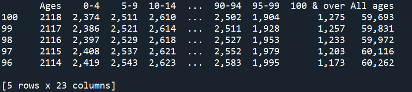

# Introduction-to-Pandas
A guide of Pandas - The Python library for data manipulation and analysis

* [Section 1 - About Pandas](#section-1---about-pandas)
* [Section 2 - Importing Data](#section-2---importing-data)
* [Section 3 - Inspecting Data](#section-3---inspecting-data)
  * [Head](#head)
  * [Info](#info)
  * [Shape](#shape)
  * [Describe](#describe)
  * [Values](#values)
  * [Columns](#columns)
  * [Index](#index)
* [Section 4 - Sorting Data](#section-4---sorting-data)
  * [Ascending](#ascending)
  * [Descending](#descending)
  * [Sorting Multiple Columns](#sorting-multiple-columns)
* [Section 5 - Subsetting Data](#section-5---subsetting-data)
  * [Subsetting Columns](#subsetting-columns)
    * [By Key](#by-key)
    * [By Variables](#by-variables)
    * [Subsetting Multiple Columns (By Name)](#subsetting-multiple-columns-by-name)
    * * [Subsetting Multiple Columns (By Index)](#subsetting-multiple-columns-by-index)
    * [Using Relational Operators](#using-relational-operators)
      * [Using isin](#using-isin)
    * [Relational Operators By Variables](#relational-operators-by-variables)
  * [Subsetting Rows](#subsetting-rows)
    * [By Row Number](#by-row-number)
    * [Subsetting Multiple Rows](#subsetting-multiple-rows)
  * [Resetting Indexes](#resetting-indexes)
    * [Resetting Indexes Inplace](#resetting-indexes-inplace)
* [Section 6 - Modifying DataFrames](#section-6---modifying-dataframes)
  * [Manual Column Creation](#manual-column-creation)
  * [Blanket Column Creation](#blanket-column-creation)
  * [Using Existing Data](#using-existing-data)
  * [Column Operations (apply)](#column-operations-apply)

## Section 1 - About Pandas


For this introduction I will be using the population age structure as a dataset. The dataset was created in 2018 and contains the estimated population age structure in thousands in 5 year increments. Please see below:


## Section 2 - Importing Data

To access the data you first need to import pandas and load in the csv file to a DataFrame.

 ```python
import pandas as pd

df = pd.read_csv("datafeed/population_age_structure_uk.csv")
 ``` 

## Section 3 - Inspecting Data
 
 From there, there are various inspections that can be done to explore the dataset and see what it contains.

| Function | Description |
| :-: | :-: | 
| .head(x) | Returns the first x rows of the DataFrame. Defaults as 5 rows |
| .info() | Displays information for each column (data type and number of missing values). | 
| .shape | Returns the number of rows and columns of the DataFrame. | 
| .describe() | Calculates a few summary statistics for each column (count and unique values).| 
| .values | Used to get a Numpy representation of the DataFrame.| 
| .columns | Returns the column labels of the DataFrame.| 
| .index | Return the index information of the DataFrame.| 

The results with the polulation age structure can be seen below:

### Head

 ```python
import pandas as pd

df = pd.read_csv("datafeed/population_age_structure_uk.csv")
print(df.head())
 ``` 
 
 
  ```python
import pandas as pd

df = pd.read_csv("datafeed/population_age_structure_uk.csv")
print(df.head(3))
 ``` 
 
 
 ### Info
 
  ```python
import pandas as pd

df = pd.read_csv("datafeed/population_age_structure_uk.csv")
print(df.info())
 ``` 

 
 ### Shape
 
  ```python
import pandas as pd

df = pd.read_csv("datafeed/population_age_structure_uk.csv")
print(df.shape)
 ``` 
 

 
 ### Describe
 
  ```python
import pandas as pd

df = pd.read_csv("datafeed/population_age_structure_uk.csv")
print(df.describe())
 ``` 


 ### Values
 
  ```python
import pandas as pd

df = pd.read_csv("datafeed/population_age_structure_uk.csv")
print(df.values)
 ```


 ### Columns

```python
import pandas as pd

df = pd.read_csv("datafeed/population_age_structure_uk.csv")
print(df.columns)
 ```
 
 
### Index
 
```python
import pandas as pd

df = pd.read_csv("datafeed/population_age_structure_uk.csv")
print(df.index)
```

 
 
 ## Section 4 - Sorting Data
 
 ### Ascending
 
 You can sort columns by their values ising the sort_values() function.:
 
 ```python
import pandas as pd

df = pd.read_csv("datafeed/population_age_structure_uk.csv")
df = df.sort_values("All ages")
print(df.head())
```

 
 
 ### Descending
 
 The ordering can be either ascending or descending with ascending = True being the default.

 ```python
import pandas as pd

df = pd.read_csv("datafeed/population_age_structure_uk.csv")
df = df.sort_values("All ages", ascending = False)
print(df.head())
```

 
 
  ### Sorting Multiple Columns
  
 Multiple columns can be sorted depending on their argument order. Ensure to use the double brackets or the comma won't work. The type of sort can then be controlled by inputting a boolean list  
 
  ```python
import pandas as pd

df = pd.read_csv("datafeed/population_age_structure_uk.csv")
df = df.sort_values(["0-4", "95-99"] ascending = [True, False])
print(df.head())
```
 
 
 ## Section 5 - Subsetting Data
 
 ### Subsetting Columns
 
 #### By Key
 Different columns can be selected by using the code below:
 
```python
import pandas as pd

df = pd.read_csv("datafeed/population_age_structure_uk.csv")
df_over_hundred = df["100 & over"]
print(df_over_hundred.head())
```
 
 
#### By Variables

If the heading of the columns follow the basic python variable naming rules. The columns can also be accessed as a variable.

```python
import pandas as pd

df = pd.read_csv("datafeed/population_age_structure_uk.csv")
df = df.all_ages
print(df)
```


#### Subsetting Multiple Columns (By Name)

Multiple columns can be subset as shown:

```python
import pandas as pd

df = pd.read_csv("datafeed/population_age_structure_uk.csv")
df = df[["100 & over", "All ages"]]
print(df.head())
```


#### Subsetting Multiple Columns (By Index)

Columns can also be selected using the index location method and list slicing:

```python
import pandas as pd

df = pd.read_csv("datafeed/population_age_structure_uk.csv")
df = df.iloc[:,0:3]
print(df.head())
```


 
 #### Using Relational Operators
  
 The DataFrame can be filtered by using a relational operator to return True or False for each row and pass that inside square brackets as shown.

```python
import pandas as pd

df = pd.read_csv("datafeed/population_age_structure_uk.csv")
df = df[(df["100 & over"] > 200) & (df["5-9"] < 3000)]
print(df.head())
```


##### Using isin

Instead of using the "or" operator (|) to select multple rows. The isin() method allows only one condition to be writen instead of multiple.

```python
import pandas as pd

df = pd.read_csv("datafeed/population_age_structure_uk.csv")

next_five_years = [2023, 2023, 2024, 2025, 2026]

df = df[df["Ages"].isin(next_five_years)]
print(df)
```

 
 
#### Relational Operators by Variables

```python
import pandas as pd

df = pd.read_csv("datafeed/population_age_structure_uk.csv")
df = df[(df.all_ages > 65000) & (df.years >2070)]
print(df)
```


 
 ### Subsetting Rows
 
 #### By Row Number
 
 You can select a single row using iloc.
 
```python
import pandas as pd

df = pd.read_csv("datafeed/population_age_structure_uk.csv")
current_year = df.iloc[4]
print(current_year.head())
```

 
 
  #### Subsetting Multiple Rows
  
  You can select multiple rows through list splicing.
  
  ```python
import pandas as pd

df = pd.read_csv("datafeed/population_age_structure_uk.csv")
past_to_current_year = df.iloc[:4]
print(past_to_current_year.head())
```

 
  
 
 ### Resetting Indexes
 
 When different rows are being selected the indexes can be out of order. To reset the indices use the reset_index() function.
 
```python
import pandas as pd

df = pd.read_csv("datafeed/population_age_structure_uk.csv")
df = df.iloc[[2, 4, 6]]
print(df)
df = df.reset_index()
print(df)
```

 
 
 #### Resetting Indexes Inplace
 
The inplace and drop arguments can also be used to reorder and remove all other data from the DataFrame itself without needing to assign the result.

 ```python
import pandas as pd

df = pd.read_csv("datafeed/population_age_structure_uk.csv")
df = df.iloc[[2, 4, 6]]
print(df)
df.reset_index(inplace = True, drop = True)
print(df)
```


 
## Section 6 - Modifying DataFrames

### Manual Column Creation

A new column can be added to the DataFrame by inserting a new list with matching length to the existing dataframe

```python
import pandas as pd

df = pd.read_csv("datafeed/population_age_structure_uk.csv")
df = df.head(2)

df["New Column"] = ["New", "New"]
print(df)
```


### Blanket Column Creation

When a list is not used. All values in the new column will be equal to the value on the right.

```python
import pandas as pd

df = pd.read_csv("datafeed/population_age_structure_uk.csv")
df["Valid"] = True
print(df)
```


### Using Existing Data

Often the values in the new table will be based on data in existing columns

```python
import pandas as pd

df = pd.read_csv("datafeed/population_age_structure_uk.csv")
df["All Ages (in millions)"] = df["All ages"] * 1000
print(df.head())
```


### Column Operations (apply)

The apply function can be used to modify all entries in a DataFrame or Series. It applies any function to the values. For instance it can take a column entries as shown below:

```python
import pandas as pd

df = pd.read_csv("datafeed/population_age_structure_uk.csv")
df["New Column] = "Yes
print(df.head())
```


and use the str.lower function to make them lowercase.

```python
import pandas as pd

df = pd.read_csv("datafeed/population_age_structure_uk.csv")
df["New Column] = "df[New Column"].apply(str.lower
print(df.head())
```


### Lambda Fucntions
